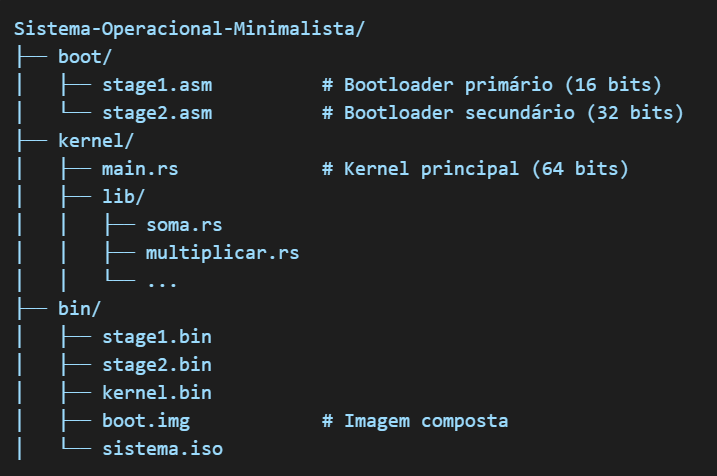

# Primeiros passo

## 🧠 Multistage (16/32/64 bits)

1. **Bootloader Primário (16 bits)** - Inicializa a máquina no modo real e carrega o segundo estágio em `0x08000`.
2. **Bootloader Secundário (32 bits)** - Entra em modo protegido e carrega o kernel em `0x100000`.
3. **Kernel (64 bits)** - Escrito em Rust, roda no modo de longa duração.
4. **Módulos adicionais** - Funções como soma, multiplicação, etc., escritas em Rust.

---

## 🧱 Estrutura do Projeto


<p align="center">
  
</p>


---

## 🚀 Processo de Construção

### 1. Compile o Bootloader Primário (16 bits)

```bash
nasm -f bin boot/stage1.asm -o bin/stage1.bin
```

### 2. Compile o Bootloader Secundário (32 bits)

```bash
nasm -f bin boot/stage2.asm -o bin/stage2.bin
```

### 3. Compile o Kernel (64 bits em Rust) e convertelo para .bin

```bash
cd kernel
cargo build --release --target x86_64-unknown-none
cargo install cargo-binutils
rustup component add llvm-tools-preview
rust-objcopy --binary-architecture=i386:x86-64 -O binary target/x86_64-unknown-none/release/kernel ../bin/kernel.bin
cd ..
```

## 🔗 Unindo as Partes 

Estou usando bash então usarei cat para concatenar os arquivos.

```bash
cat bin/stage1.bin bin/stage2.bin bin/kernel.bin > img/boot.img
```

## 📀 Criando a ISO Bootável

```bash
mkisofs -o SOS/zyrusOS.iso -b boot.img -no-emul-boot -boot-load-size 4 -boot-info-table img/
```

